# 一、初识 Redis

Redis 是一种键值型的 NoSQL 数据库，这里有两个关键字：

- 键值型

- NoSQL

其中**键值型**，是指 Redis 中存储的数据都是以 key、value 对的形式存储，而 value 的形式多种多样，可以是字符串、数值、甚至 JSON：


而 NoSQL 则是相对于传统关系型数据库而言，有很大差异的一种数据库。

对于存储的数据，没有类似 MySQL 那么严格的约束，比如唯一性，是否可以为 null 等等，所以我们把这种松散结构的数据库，称之为 NoSQL 数据库。

## 1、认识 NoSQL

**NoSQL** 可以翻译做 Not Only SQL（不仅仅是 SQL），或者是 No SQL（非 SQL 的）数据库。是相对于传统关系型数据库而言，有很大差异的一种特殊的数据库，因此也称之为**非关系型数据库**。

### 1.1、结构化与非结构化

传统关系型数据库是结构化数据，每一张表都有严格的约束信息：字段名、字段数据类型、字段约束等等信息，插入的数据必须遵守这些约束：


而 NoSQL 则对数据库格式没有严格约束，往往形式松散，自由。

可以是键值型：


也可以是文档型：


甚至可以是图格式：


### 1.2、关联和非关联

传统数据库的表与表之间往往存在关联，例如外键：


而非关系型数据库不存在关联关系，要维护关系要么靠代码中的业务逻辑，要么靠数据之间的耦合：

```json
{
  id: 1,
  name: "张三",
  orders: [
    {
       id: 1,
       item: {
	     id: 10, title: "荣耀6", price: 4999
       }
    },
    {
       id: 2,
       item: {
	     id: 20, title: "小米11", price: 3999
       }
    }
  ]
}
```

此处要维护 “张三” 的订单与商品 “荣耀” 和 “小米 11” 的关系，不得不冗余的将这两个商品保存在张三的订单文档中，不够优雅。还是建议用业务来维护关联关系。

### 1.3、查询方式

传统关系型数据库会基于 SQL 语句做查询，语法有统一标准；

而不同的非关系数据库查询语法差异极大，五花八门各种各样。


### 1.4、事务

传统关系型数据库能满足事务 ACID 的原则。

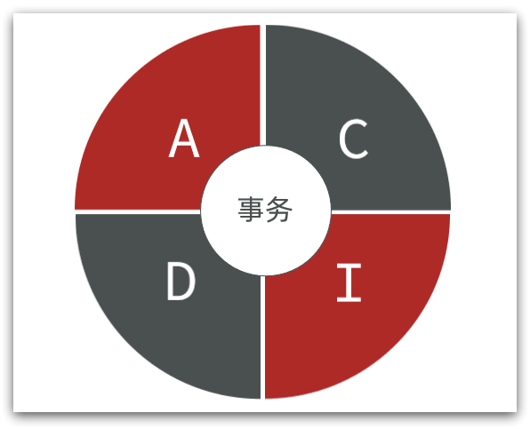

而非关系型数据库往往不支持事务，或者不能严格保证 ACID 的特性，只能实现基本的一致性。

### 1.5、总结

除了上述四点以外，在存储方式、扩展性、查询性能上关系型与非关系型也都有着显著差异，总结如下：


- 存储方式
  - 关系型数据库基于磁盘进行存储，会有大量的磁盘 IO，对性能有一定影响
  - 非关系型数据库的操作更多依赖于内存来操作，内存的读写速度会非常快，性能自然会好一些

* 扩展性
  * 关系型数据库集群模式一般是主从，主从数据一致，起到数据备份的作用，称为垂直扩展。
  * 非关系型数据库可以将数据拆分，存储在不同机器上，可以保存海量数据，解决内存大小有限的问题。称为水平扩展。
  * 关系型数据库因为表之间存在关联关系，如果做水平扩展会给数据查询带来很多麻烦

## 2、认识 Redis

Redis 诞生于 2009 年，全称是 **Re**mote **Di**ctionary **S**erver 远程词典服务器，是一个基于内存的键值型 NoSQL 数据库。

**特征**：

- 键值（key-value）型，value 支持多种不同数据结构，功能丰富
- 单线程，每个命令具备原子性
- 低延迟，速度快（基于内存、IO 多路复用、良好的编码）
- 支持数据持久化
- 支持主从集群、分片集群
- 支持多语言客户端

**作者**：Antirez

Redis 的官方网站地址：[https://redis.io/](https://redis.io/)

## 3、安装Redis

大多数企业都是基于 Linux 服务器来部署项目，而且 Redis 官方也没有提供 Windows 版本的安装包。因此课程中我们会基于 Linux 系统来安装 Redis。

此处选择的 Linux 版本为 CentOS 7。

### 3.1、安装 Redis 依赖

Redis 是基于 C 语言编写的，因此首先需要安装 Redis 所需要的 gcc 依赖：

```sh
yum install -y gcc tcl
```

### 3.2、上传安装包并解压

然后将课前资料提供的 Redis 安装包上传到虚拟机的任意目录：


例如，我放到了 /usr/local/src 目录：


解压缩：

```sh
tar -xzf redis-6.2.6.tar.gz
```

解压后：


进入 Redis 目录：

```sh
cd redis-6.2.6
```

运行编译命令：

```sh
make && make install
```

如果没有出错，应该就安装成功了。

默认的安装路径是在 `/usr/local/bin` 目录下：

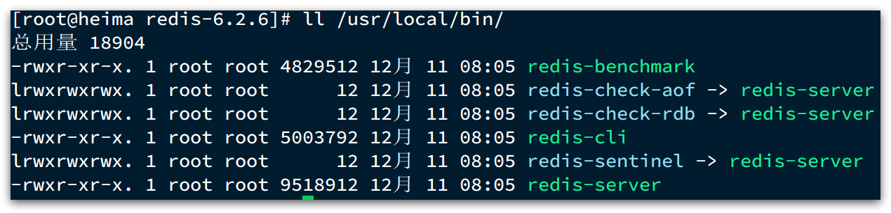

该目录已经默认配置到环境变量，因此可以在任意目录下运行这些命令。其中：

- `redis-cli`：是 Redis 提供的命令行客户端
- `redis-server`：是 Redis 的服务端启动脚本
- `redis-sentinel`：是 Redis 的哨兵启动脚本

### 3.3、启动

Redis 的启动方式有很多种，例如：

- 默认启动
- 指定配置启动
- 开机自启

### 3.4、默认启动

安装完成后，在任意目录输入 `redis-server` 命令即可启动 Redis：

```sh
redis-server
```

如图：


这种启动属于`前台启动`，会阻塞整个会话窗口，窗口关闭或者按下 `CTRL + C` 则 Redis 停止。不推荐使用。

### 3.5、指定配置启动

如果要让 Redis 以`后台`方式启动，则必须修改 Redis 配置文件，就在我们之前解压的 Redis 安装包下（`/usr/local/src/redis-6.2.6`），名字叫 redis.conf：


我们先将这个配置文件备份一份：

```sh
cp redis.conf redis.conf.bck
```

然后修改 redis.conf 文件中的一些配置：

```properties
# 监听的地址，默认是127.0.0.1，会导致只能在本地访问。修改为0.0.0.0则可以在任意IP访问，生产环境不要设置为0.0.0.0
bind 0.0.0.0
# 守护进程，修改为yes后即可后台运行
daemonize yes
# 密码，设置后访问Redis必须输入密码
requirepass 123321
```

Redis 的其它常见配置：

```properties
# 监听的端口
port 6379
# 工作目录，默认是当前目录，也就是运行redis-server时的命令，日志、持久化等文件会保存在这个目录
dir .
# 数据库数量，设置为1，代表只使用1个库，默认有16个库，编号0~15
databases 1
# 设置Redis能够使用的最大内存
maxmemory 512mb
# 日志文件，默认为空，不记录日志，可以指定日志文件名
logfile "redis.log"
```

启动 Redis：

```sh
# 进入Redis安装目录
cd /usr/local/src/redis-6.2.6
# 启动
redis-server redis.conf
```

停止服务：

```sh
# 利用redis-cli来执行 shutdown 命令，即可停止 Redis 服务，
# 因为之前配置了密码，因此需要通过 -u 来指定密码
redis-cli -u 123321 shutdown
```

### 3.6、开机自启

我们也可以通过配置来实现开机自启。

首先，新建一个系统服务文件：

```sh
vi /etc/systemd/system/redis.service
```

内容如下：

```conf
[Unit]
Description=redis-server
After=network.target

[Service]
Type=forking
ExecStart=/usr/local/bin/redis-server /usr/local/src/redis-6.2.6/redis.conf
PrivateTmp=true

[Install]
WantedBy=multi-user.target
```

然后重载系统服务：

```sh
systemctl daemon-reload
```

现在，我们可以用下面这组命令来操作 Redis了：

```sh
# 启动
systemctl start redis
# 停止
systemctl stop redis
# 重启
systemctl restart redis
# 查看状态
systemctl status redis
```

执行下面的命令，可以让 Redis 开机自启：

```sh
systemctl enable redis
```

## 4、Redis 客户端

安装完成 Redis，我们就可以操作 Redis，实现数据的 CRUD 了。这需要用到 Redis 客户端，包括：

- 命令行客户端
- 图形化桌面客户端
- 编程客户端

### 4.1、Redis命令行客户端

Redis 安装完成后就自带了命令行客户端：redis-cli，使用方式如下：

```sh
redis-cli [options] [commonds]
```

其中常见的 options 有：

- `-h 127.0.0.1`：指定要连接的 Redis 节点的 IP 地址，默认是 127.0.0.1
- `-p 6379`：指定要连接的 Redis 节点的端口，默认是 6379
- `-a 123321`：指定 Redis 的访问密码

其中的 commonds 就是 Redis 的操作命令，例如：

- `ping`：与 Redis 服务端做心跳测试，服务端正常会返回 `pong`

不指定 commond 时，会进入 `redis-cli` 的交互控制台：


### 4.2、图形化桌面客户端

GitHub 上的大神编写了 Redis 的图形化桌面客户端，地址：[https://github.com/uglide/RedisDesktopManager](https://github.com/uglide/RedisDesktopManager)

不过该仓库提供的是 RedisDesktopManager 的源码，并未提供 Windows 安装包。

在下面这个仓库可以找到安装包：[https://github.com/lework/RedisDesktopManager-Windows/releases](https://github.com/lework/RedisDesktopManager-Windows/releases)

### 4.3、安装

在课前资料中可以找到 Redis 的图形化桌面客户端：


解压缩后，运行安装程序即可安装：


安装完成后，在安装目录下找到 rdm.exe 文件：


双击即可运行：


### 4.4、建立连接

点击左上角的 `连接到 Redis 服务器` 按钮：


在弹出的窗口中填写 Redis 服务信息：

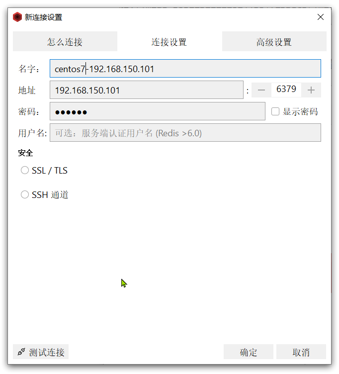

点击确定后，在左侧菜单会出现这个链接：


点击即可建立连接了。


Redis 默认有 16 个仓库，编号从 0 至 15。通过配置文件可以设置仓库数量，但是不超过 16，并且不能自定义仓库名称。

如果是基于 redis-cli 连接 Redis 服务，可以通过 select 命令来选择数据库：

```sh
# 选择0号库
select 0
```

# 二、Redis 常见命令

## 1、Redis 数据结构介绍

Redis 是典型的 key-value 数据库，key 一般是字符串，而 value 包含很多不同的数据类型：


> **tips：命令不要死记，学会查询就好**

Redis 为了方便我们学习，将操作不同数据类型的命令也做了分组，在官网（[https://redis.io/commands](https://redis.io/commands)）可以查看到不同的命令：


不同类型的命令称为一个 group，我们也可以通过 help 命令来查看各种不同 group 的命令：


接下来，我们就学习常见的五种基本数据类型的相关命令。

## 2、Redis 通用命令

通用指令是部分数据类型的，都可以使用的指令，常见的有：

- `KEYS`：查看符合模板的所有 key，不建议在生产环境设备上使用
- `DEL`：删除一个指定的 key
- `EXISTS`：判断 key 是否存在
- `EXPIRE`：给一个 key 设置有效期，有效期到期时该 key 会被自动删除
- `TTL`：查看一个 KEY 的剩余有效期

通过 `help [command]` 可以查看一个命令的具体用法，例如：

```shell
# 查看keys命令的帮助信息：
127.0.0.1:6379> help keys

  KEYS pattern
  summary: Find all keys matching the given pattern
  since: 1.0.0
  group: generic
```

示例代码：

* KEYS

```shell
127.0.0.1:6379> keys *
1) "name"
2) "age"
127.0.0.1:6379>

# 查询以a开头的key
127.0.0.1:6379> keys a*
1) "age"
127.0.0.1:6379>
```

> **tips：在生产环境下，不推荐使用 keys 命令，因为这个命令在 key 过多的情况下，效率不高**

* DEL

```shell
127.0.0.1:6379> help del

  DEL key [key ...]
  summary: Delete a key
  since: 1.0.0
  group: generic

127.0.0.1:6379> del name #删除单个
(integer) 1  #成功删除1个

127.0.0.1:6379> keys *
1) "age"

127.0.0.1:6379> MSET k1 v1 k2 v2 k3 v3 #批量添加数据
OK

127.0.0.1:6379> keys *
1) "k3"
2) "k2"
3) "k1"
4) "age"

127.0.0.1:6379> del k1 k2 k3 k4
(integer) 3   #此处返回的是成功删除的key个数，由于Redis中只有k1,k2,k3 所以只成功删除3个，最终返回
127.0.0.1:6379>

127.0.0.1:6379> keys * #再查询全部的key
1) "age"	#只剩下一个了
127.0.0.1:6379>
```

* EXISTS

```shell
127.0.0.1:6379> help EXISTS

  EXISTS key [key ...]
  summary: Determine if a key exists
  since: 1.0.0
  group: generic

127.0.0.1:6379> exists age
(integer) 1

127.0.0.1:6379> exists name
(integer) 0
```

* EXPIRE 和 TTL

> **tips：内存非常宝贵，对于一些数据，我们应当给它一些过期时间，当过期时间到了之后，它就会自动被删除**

```shell
127.0.0.1:6379> expire age 10
(integer) 1

127.0.0.1:6379> ttl age
(integer) 8

127.0.0.1:6379> ttl age
(integer) 6

127.0.0.1:6379> ttl age
(integer) -2

127.0.0.1:6379> ttl age
(integer) -2  #当这个key过期了，那么此时查询出来就是-2 

127.0.0.1:6379> keys *
(empty list or set)

127.0.0.1:6379> set age 10
OK

127.0.0.1:6379> ttl age
(integer) -1  # 如果没有设置过期时间，ttl的返回值就是-1
```

## 3、String 类型

String 类型，也就是字符串类型，是 Redis 中最简单的存储类型。

其 value 是字符串，不过根据字符串的格式不同，又可以分为 3 类：

- string：普通字符串
- int：整数类型，可以做自增、自减操作
- float：浮点类型，可以做自增、自减操作

不管是哪种格式，底层都是字节数组形式存储，只不过是编码方式不同。字符串类型的最大空间不能超过 512 M。


### 3.1、String 的常见命令

String 的常见命令有：

- `SET`：添加或者修改已经存在的一个 String 类型的键值对
- `GET`：根据 key 获取 String 类型的 value
- `MSET`：批量添加多个 String 类型的键值对
- `MGET`：根据多个 key 获取多个 String 类型的 value
- `INCR`：让一个整型的 key 自增 1
- `INCRBY`：让一个整型的 key 自增并指定步长，例如：`incrby num 2` 让 num 值自增 2
- `INCRBYFLOAT`：让一个浮点类型的数字自增并指定步长
- `SETNX`：添加一个 String 类型的键值对，前提是这个 key 不存在，否则不执行
- `SETEX`：添加一个 String 类型的键值对，并且指定有效期

> 以上命令除了 INCRBYFLOAT 都是常用命令

* SET 和 GET：如果 key 不存在则是新增，如果存在则是修改

```shell
127.0.0.1:6379> set name Rose  # 原来不存在
OK

127.0.0.1:6379> get name 
"Rose"

127.0.0.1:6379> set name Jack # 原来存在，就是修改
OK

127.0.0.1:6379> get name
"Jack"
```

* MSET 和 MGET

```shell
127.0.0.1:6379> MSET k1 v1 k2 v2 k3 v3
OK

127.0.0.1:6379> MGET name age k1 k2 k3
1) "Jack" # 之前存在的name
2) "10"   # 之前存在的age
3) "v1"
4) "v2"
5) "v3"
```

* INCR 和 INCRBY 和 DECY

```shell
127.0.0.1:6379> get age 
"10"

127.0.0.1:6379> incr age # 增加1
(integer) 11
    
127.0.0.1:6379> get age # 获得age
"11"

127.0.0.1:6379> incrby age 2 # 一次增加2
(integer) 13 # 返回目前的age的值
    
127.0.0.1:6379> incrby age 2
(integer) 15
    
127.0.0.1:6379> incrby age -1 # 也可以增加负数，相当于减
(integer) 14
    
127.0.0.1:6379> incrby age -2 # 一次减少2个
(integer) 12
    
127.0.0.1:6379> DECR age # 相当于 incr 负数，减少正常用法
(integer) 11
    
127.0.0.1:6379> get age
"11"
```

* INCRBYFLOAT

```shell
localhost:6379> set score 10.1
OK

localhost:6379> get score
"10.1"

localhost:6379> incrbyfloat score 0.5
"10.6"

localhost:6379> incrbyfloat score 0.5
"11.1"

localhost:6379> incrbyfloat score 0.5
"11.6"
```

* SETNX

```shell
127.0.0.1:6379> help setnx

  SETNX key value
  summary: Set the value of a key, only if the key does not exist
  since: 1.0.0
  group: string

127.0.0.1:6379> set name Jack  # 设置名称
OK
127.0.0.1:6379> setnx name lisi # 如果key不存在，则添加成功
(integer) 0
127.0.0.1:6379> get name # 由于name已经存在，所以lisi的操作失败
"Jack"
127.0.0.1:6379> setnx name2 lisi # name2不存在，所以操作成功
(integer) 1
127.0.0.1:6379> get name2 
"lisi"

127.0.0.1:6379> set name wangwu nx # 和setnx效果一样
(nil)
127.0.0.1:6379> get name
"jack"
```

* SETEX

```shell
127.0.0.1:6379> setex name 10 jack
OK

127.0.0.1:6379> ttl name
(integer) 8

127.0.0.1:6379> ttl name
(integer) 7

127.0.0.1:6379> ttl name
(integer) 5

127.0.0.1:6379> set name jack ex 10 # 和setex效果一样
OK
127.0.0.1:6379> ttl name
(integer) 6
127.0.0.1:6379> ttl name
(integer) 3
```

### 3.2、Key 的层级格式

Redis 没有类似 MySQL 中的 Table 的概念，我们该如何区分不同类型的 key 呢？

例如，需要存储用户、商品信息到 Redis，有一个用户 id 是 1，有一个商品 id 恰好也是 1，此时如果使用 id 作为 key，那就会冲突了，该怎么办？

我们可以通过给 key 添加前缀加以区分，不过这个前缀不是随便加的，有一定的规范：

Redis 的 key 允许有多个单词形成层级结构，多个单词之间用 ':' 隔开，格式如下：

```
项目名:业务名:类型:id
```

这个格式并非固定，也可以根据自己的需求来删除或添加词条。这样一来，我们就可以把不同类型的数据区分开了，从而避免了 key 的冲突问题。

例如我们的项目名称叫 heima，有 user 和 product 两种不同类型的数据，我们可以这样定义 key：

- user 相关的 key：`heima:user:1`

- product 相关的 key：`heima:product:1`

如果 Value 是一个 Java 对象，例如一个 User 对象，则可以将对象序列化为 JSON 字符串后存储：

| KEY             | VALUE                                      |
| --------------- | ------------------------------------------ |
| heima:user:1    | {"id":1,  "name": "Jack", "age": 21}       |
| heima:product:1 | {"id":1,  "name": "小米11", "price": 4999} |

并且，在 Redis 的桌面客户端中，还会以相同前缀作为层级结构，让数据看起来层次分明，关系清晰：

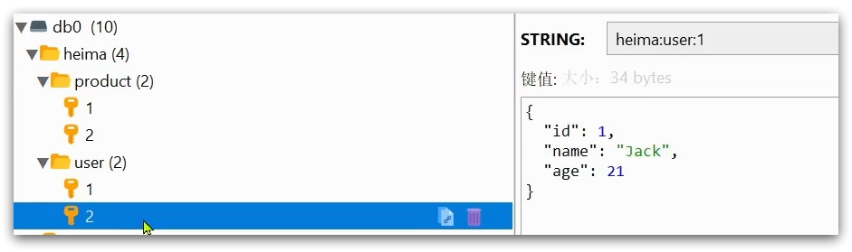

## 4、Hash 类型

Hash 类型，也叫散列，其 value 是一个无序字典，类似于 Java 中的 HashMap 结构。

String 结构是将对象序列化为 JSON 字符串后存储，当需要修改对象某个字段时很不方便：


Hash 结构可以将对象中的每个字段独立存储，可以针对单个字段做 CRUD：

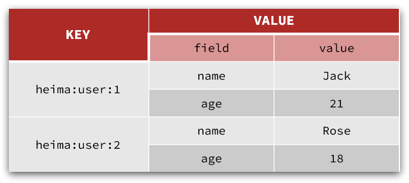

Hash 类型的常见命令有：

- `HSET key field value`：添加或者修改 hash 类型 key 的 field 的值

- `HGET key field`：获取一个 hash 类型 key 的 field 的值

- `HMSET`：批量添加多个 hash 类型 key 的 field 的值

- `HMGET`：批量获取多个 hash 类型 key 的 field 的值

- `HGETALL`：获取一个 hash 类型的 key 中的所有的 field 和 value
- `HKEYS`：获取一个 hash 类型的 key 中的所有的 field
- `HVALS`：获取一个 hash 类型的 key 中的所有的 value
- `HINCRBY`：让一个 hash 类型 key 的字段值自增并指定步长
- `HSETNX`：添加一个 hash 类型的 key 的 field 值，前提是这个 field 不存在，否则不执行

> 哈希结构也是我们以后实际开发中常用的命令

* HSET 和 HGET

```shell
127.0.0.1:6379> HSET heima:user:3 name Lucy # 大key是 heima:user:3，小key是name，小value是Lucy
(integer) 1

127.0.0.1:6379> HSET heima:user:3 age 21 # 如果操作不存在的数据，则是新增
(integer) 1

127.0.0.1:6379> HSET heima:user:3 age 17 # 如果操作存在的数据，则是修改
(integer) 0

127.0.0.1:6379> HGET heima:user:3 name 
"Lucy"

127.0.0.1:6379> HGET heima:user:3 age
"17"
```

* HMSET 和 HMGET

```shell
127.0.0.1:6379> HMSET heima:user:4 name HanMeiMei
OK

127.0.0.1:6379> HMSET heima:user:4 name LiLei age 20 sex man
OK

127.0.0.1:6379> HMGET heima:user:4 name age sex
1) "LiLei"
2) "20"
3) "man"
```

* HGETALL

```shell
127.0.0.1:6379> HGETALL heima:user:4
1) "name"
2) "LiLei"
3) "age"
4) "20"
5) "sex"
6) "man"
```

* HKEYS 和 HVALS

```shell
127.0.0.1:6379> HKEYS heima:user:4
1) "name"
2) "age"
3) "sex"

127.0.0.1:6379> HVALS heima:user:4
1) "LiLei"
2) "20"
3) "man"
```

* HINCRBY

```shell
127.0.0.1:6379> HINCRBY heima:user:4 age 2
(integer) 22

127.0.0.1:6379> HVALS heima:user:4
1) "LiLei"
2) "22"
3) "man"

127.0.0.1:6379> HINCRBY  heima:user:4 age -2
(integer) 20
```

* HSETNX

```shell
127.0.0.1:6379> HSETNX heima:user4 sex woman
(integer) 0

127.0.0.1:6379> HGETALL heima:user:3
1) "name"
2) "Lucy"
3) "age"
4) "17"

127.0.0.1:6379> HSETNX heima:user:3 sex woman
(integer) 1

127.0.0.1:6379> HGETALL heima:user:3
1) "name"
2) "Lucy"
3) "age"
4) "17"
5) "sex"
6) "woman"
```

## 5、List 类型

Redis 中的 List 类型与 Java 中的 LinkedList 类似，可以看做是一个双向链表结构。既可以支持正向检索和也可以支持反向检索。

特征也与 LinkedList 类似：

- 有序
- 元素可以重复
- 插入和删除快
- 查询速度一般

常用来存储一个有序数据，例如：朋友圈点赞列表，评论列表等。

List 的常见命令有：

- `LPUSH key element ...`：向列表左侧插入一个或多个元素
- `LPOP key`：移除并返回列表左侧的第一个元素，没有则返回 nil
- `RPUSH key element ...`：向列表右侧插入一个或多个元素
- `RPOP key`：移除并返回列表右侧的第一个元素，没有则返回 nil
- `LRANGE key star end`：返回一段角标范围内的所有元素
- `BLPOP` 和 `BRPOP`：与 LPOP 和 RPOP 类似，只不过在没有元素时等待指定时间，而不是直接返回 nil（B 代表 Block 阻塞）


* LPUSH 和 RPUSH

```shell
127.0.0.1:6379> LPUSH users 1 2 3
(integer) 3

127.0.0.1:6379> RPUSH users 4 5 6
(integer) 6
```

* LPOP 和 RPOP

```shell
127.0.0.1:6379> LPOP users
"3"

127.0.0.1:6379> RPOP users
"6"
```

* LRANGE

```shell
127.0.0.1:6379> LRANGE users 1 2
1) "1"
2) "4"
```

* BLPOP 和 BRPOP

```shell
127.0.0.1:6379> blpop users2 100
(nil)
(100.02s)

127.0.0.1:6379> brpop users2 100
(nil)
(100.03s)
```

如何利用 List 结构模拟一个栈？

* 入口和出口在同一边，LPUSH + LPOP 或 RPUSH + RPOP

如何利用 List 结构模拟一个队列？

* 入口和出口在不同边，LPUSH + RPOP 或 RPUSH + LPOP

如何利用 List 结构模拟一个阻塞队列？

* 入口和出口在不同边
* 出队时采用 BLPOP 或 BRPOP

## 6、Set 类型

Redis 的 Set 结构与 Java 中的 HashSet 类似，可以看做是一个 value 为 null 的 HashMap。因为也是一个 hash 表，因此具备与 HashSet 类似的特征：

- 无序

- 元素不可重复

- 查找快

- 支持交集、并集、差集等功能

Set 类型的常见命令有：

- `SADD key member ...`：向 set 中添加一个或多个元素
- `SREM key member ...`: 移除 set 中的指定元素
- `SCARD key`： 返回 set 中元素的个数
- `SISMEMBER key member`：判断一个元素是否存在于 set 中
- `SMEMBERS`：获取 set 中的所有元素
- `SINTER key1 key2 ...`：求 key1 与 key2 的交集
- `SDIFF key1 key2 ...`：求 key1 与 key2 的差集
- `SUNION key1 key2 ...`：求 key1 与 key2 的并集

例如两个集合 s1 和 s2：

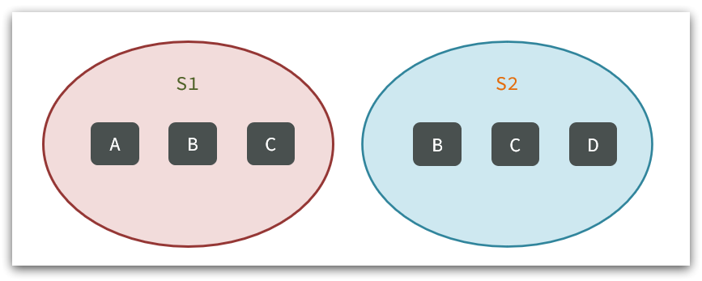

求交集：`SINTER s1 s2`

求 s1 与 s2 的不同：`SDIFF s1 s2`


```sh
127.0.0.1:6379> sadd s1 a b c
(integer) 3

127.0.0.1:6379> smembers s1
1) "c"
2) "b"
3) "a"

127.0.0.1:6379> srem s1 a
(integer) 1
    
127.0.0.1:6379> SISMEMBER s1 a
(integer) 0
    
127.0.0.1:6379> SISMEMBER s1 b
(integer) 1
    
127.0.0.1:6379> SCARD s1
(integer) 2
```

练习：

1、将下列数据用 Redis 的 Set 集合来存储：

- 张三的好友有：李四、王五、赵六
- 李四的好友有：王五、麻子、二狗

```shell
127.0.0.1:6379> SADD zs lisi wangwu zhaoliu
(integer) 3
    
127.0.0.1:6379> SADD ls wangwu mazi ergou
(integer) 3
```

2、利用 Set 的命令实现下列功能：

- 计算张三的好友有几人
- 计算张三和李四有哪些共同好友
- 查询哪些人是张三的好友却不是李四的好友
- 查询张三和李四的好友总共有哪些人
- 判断李四是否是张三的好友
- 判断张三是否是李四的好友
- 将李四从张三的好友列表中移除

```shell
127.0.0.1:6379> SCARD zs
(integer) 3
    
127.0.0.1:6379> SINTER zs ls
1) "wangwu"
    
127.0.0.1:6379> SDIFF zs ls
1) "zhaoliu"
2) "lisi"
    
127.0.0.1:6379> SUNION zs ls
1) "wangwu"
2) "zhaoliu"
3) "lisi"
4) "mazi"
5) "ergou"
    
127.0.0.1:6379> SISMEMBER zs lisi
(integer) 1
    
127.0.0.1:6379> SISMEMBER ls zhangsan
(integer) 0
    
127.0.0.1:6379> SREM zs lisi
(integer) 1
    
127.0.0.1:6379> SMEMBERS zs
1) "zhaoliu"
2) "wangwu"
```

## 7、SortedSet 类型

Redis 的 SortedSet 是一个可排序的 set 集合，与 Java 中的 TreeSet 有些类似，但底层数据结构却差别很大。SortedSet 中的每一个元素都带有一个 score 属性，可以基于 score 属性对元素排序，底层的实现是一个跳表（SkipList）加 hash 表。

SortedSet 具备下列特性：

- 可排序
- 元素不重复
- 查询速度快

因为 SortedSet 的可排序特性，经常被用来实现排行榜这样的功能。

SortedSet 的常见命令有：

- `ZADD key score member`：添加一个或多个元素到 sorted set ，如果已经存在则更新其 score 值
- `ZREM key member`：删除 sorted set 中的一个指定元素
- `ZSCORE key member` : 获取 sorted set 中的指定元素的 score 值
- `ZRANK key member`：获取 sorted set 中的指定元素的排名
- `ZCARD key`：获取 sorted set 中的元素个数
- `ZCOUNT key min max`：统计 score 值在给定范围内的所有元素的个数
- `ZINCRBY key increment member`：让 sorted set 中的指定元素自增，步长为指定的 increment 值
- `ZRANGE key min max`：按照 score 排序后，获取指定排名范围内的元素
- `ZRANGEBYSCORE key min max`：按照 score 排序后，获取指定 score 范围内的元素
- `ZDIFF、ZINTER、ZUNION`：求差集、交集、并集

注意：所有的排名默认都是升序，如果要降序则在命令的 Z 后面添加 `REV` 即可，例如：

- **升序**获取 sorted set 中的指定元素的排名：`ZRANK key member`

- **降序**获取 sorted set 中的指定元素的排名：`ZREVRANK key memeber`

练习题：

将班级的下列学生得分存入 Redis 的 SortedSet 中：

Jack 85，Lucy 89，Rose 82，Tom 95，Jerry 78，Amy 92，Miles 76

并实现下列功能：

- 删除 Tom 同学
- 获取 Amy 同学的分数
- 获取 Rose 同学的排名
- 查询 80 分以下有几个学生
- 给 Amy 同学加 2 分
- 查出成绩前 3 名的同学
- 查出成绩 80 分以下的所有同学

```shell
127.0.0.1:6379> zadd stus 85 Jack 89 Lucy 82 Rose 95 Tom 78 Jerry 92 Amy 76 Miles
(integer) 7

127.0.0.1:6379> zrem stus Tom
(integer) 1

127.0.0.1:6379> zscore stus Amy
"94"

127.0.0.1:6379> zrank stus Rose
(integer) 2

127.0.0.1:6379> zrevrank stus Rose
(integer) 3

127.0.0.1:6379> zcard stus
(integer) 6

127.0.0.1:6379> zcount stus 0 80
(integer) 2

127.0.0.1:6379> zincrby stus 2 Amy
"94"

127.0.0.1:6379> zrange stus 0 2
1) "Miles"
2) "Jerry"
3) "Rose"

127.0.0.1:6379> zrevrange stus 0 2
1) "Amy"
2) "Lucy"
3) "Jack"

127.0.0.1:6379> zrangebyscore stus 0 80
1) "Miles"
2) "Jerry"
```

# 三、Redis 的 Java 客户端

## 1、客户端对比

在 Redis 官网中提供了各种语言的客户端，地址：[https://redis.io/docs/clients/](https://redis.io/docs/clients/)


其中 Java 客户端也包含很多：


标记为 ❤ 的就是推荐使用的 Java 客户端，包括：

* Jedis：以 Redis 命令作为方法名称，学习成本低，简单实用。但是 Jedis 实例是线程不安全的，多线程环境下需要基于连接池来使用
* Lettuce：Lettuce 是基于 Netty 实现的，支持同步、异步和响应式编程方式，并且是线程安全的。支持 Redis 的哨兵模式、集群模式和管道模式。
* Redisson：Redisson 是一个基于 Redis 实现的分布式、可伸缩的 Java 数据结构集合。包含了诸如 Map、Queue、Lock、Semaphore、AtomicLong 等强大功能

Jedis 和 Lettuce 这两个主要是提供了 Redis 命令对应的 API，方便我们操作 Redis，而 SpringDataRedis 又对这两种做了抽象和封装，因此我们后期会直接以 SpringDataRedis 来学习。

Redisson 是在 Redis 基础上实现了分布式的可伸缩的 Java 数据结构，例如 Map、Queue 等，而且支持跨进程的同步机制如 Lock、Semaphore 等等，比较适合用来实现特殊的功能需求。

## 2、Jedis 客户端

Jedis 的官网地址： [https://github.com/redis/jedis](https://github.com/redis/jedis)

### 2.1、快速入门

我们先来个快速入门，详细步骤如下：

0）创建工程：

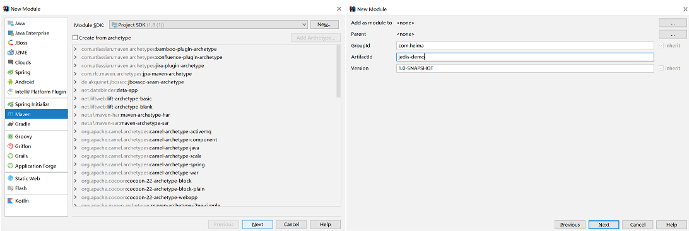

1）引入依赖：

```xml
<!--jedis-->
<dependency>
    <groupId>redis.clients</groupId>
    <artifactId>jedis</artifactId>
    <version>5.1.0</version>
</dependency>
<!--单元测试-->
<dependency>
    <groupId>org.junit.jupiter</groupId>
    <artifactId>junit-jupiter</artifactId>
    <version>5.7.1</version>
    <scope>test</scope>
</dependency>
```

2）建立连接

新建一个单元测试类，内容如下：

```java
import org.junit.jupiter.api.AfterEach;
import org.junit.jupiter.api.BeforeEach;
import org.junit.jupiter.api.Test;
import redis.clients.jedis.Jedis;

import java.util.Map;

public class JedisTest {
    private Jedis jedis;

    @BeforeEach
    void setUp() {
        // 1.建立连接
        jedis = new Jedis("127.0.0.1", 6379);
        // 2.设置密码
        jedis.auth("123456");
        // 3.选择库
        jedis.select(0);
    }
}
```

3）测试：

```java
@Test
void testString() {
    // 存入数据
    String result = jedis.set("name", "虎哥");
    System.out.println("result = " + result);
    // 获取数据
    String name = jedis.get("name");
    System.out.println("name = " + name);
}

@Test
void testHash() {
    // 插入hash数据
    jedis.hset("user:1", "name", "Jack");
    jedis.hset("user:1", "age", "21");

    // 获取数据
    String name = jedis.hget("user:1", "name");
    System.out.println("name = " + name);
    
    String age = jedis.hget("user:1", "age");
    System.out.println("age = " + age);
    
    Map<String, String> map = jedis.hgetAll("user:1");
    System.out.println(map);
}
```

4）释放资源

```java
@AfterEach
void tearDown() {
    // 关闭连接
    if (jedis != null) {
        jedis.close();
    }
}
```

> 总结 Jedis 使用的基本步骤：
>
> 1. 引入依赖
> 2. 创建 Jedis 对象，建立连接
> 3. 使用 Jedis，方法名与 Redis 命令一致
> 4. 释放资源

### 2.2、Jedis 连接池

Jedis 本身是线程不安全的，并且频繁的创建和销毁连接会有性能损耗，因此更推荐使用 Jedis 连接池代替 Jedis 的直连方式。

有关池化思想，并不仅仅是这里会使用，很多地方都有，比如说数据库连接池，比如 Tomcat 中的线程池，这些都是池化思想的体现。

#### 创建 Jedis 的连接池

```java
package com.heima.jedis.util;

import redis.clients.jedis.Jedis;
import redis.clients.jedis.JedisPool;
import redis.clients.jedis.JedisPoolConfig;

public class JedisConnectionFactory {
    private static JedisPool jedisPool;

    static {
        // 配置连接池
        JedisPoolConfig poolConfig = new JedisPoolConfig();
        // 设置连接池参数
        poolConfig.setMaxTotal(8);
        poolConfig.setMaxIdle(8);
        poolConfig.setMinIdle(0);
        poolConfig.setMaxWaitMillis(1000);
        // 创建连接池对象，参数：连接池配置、服务端ip、服务端端口、超时时间、密码
        jedisPool = new JedisPool(poolConfig, "192.168.150.101", 6379, 1000, "123321");
    }

    public static Jedis getJedis(){
        return jedisPool.getResource();
    }
}
```

**代码说明**：

1. JedisConnectionFacotry：工厂设计模式是实际开发中非常常用的一种设计模式，我们可以使用工厂，去降低代的耦合，比如 Spring 中的 Bean 的创建，就用到了工厂设计模式
2. 静态代码块：随着类的加载而加载，确保只能执行一次，我们在加载当前工厂类的时候，就可以执行 static  的操作完成对连接池的初始化
3. 最后提供返回连接池中连接的方法

#### 改造原始代码

**代码说明**：

1. 在我们完成了使用工厂设计模式来完成代码的编写之后，我们在获得连接时，就可以通过工厂来获得。而不用直接去 new 对象，降低耦合，并且使用的还是连接池对象。

2. 当我们使用了连接池后，当我们关闭连接其实并不是关闭，而是将 Jedis 还回连接池的。

```java
@BeforeEach
void setUp(){
    // 建立连接
    // jedis = new Jedis("127.0.0.1",6379);
    jedis = JedisConnectionFacotry.getJedis();
    // 设置密码
    jedis.auth("123456");
    // 选择库
    jedis.select(0);
}

@AfterEach
void tearDown() {
    // 关闭连接
    if (jedis != null) {
        jedis.close();
    }
}
```

## 3、SpringDataRedis客户端

### 3.1、介绍

SpringData 是 Spring 中数据操作的模块，包含对各种数据库的集成，其中对 Redis 的集成模块就叫做 SpringDataRedis，官网地址：[https://spring.io/projects/spring-data-redis](https://spring.io/projects/spring-data-redis)

- 提供了对不同 Redis 客户端的整合（Lettuce 和 Jedis）
- 提供了 RedisTemplate 统一 API 来操作 Redis
- 支持 Redis 的发布订阅模型
- 支持 Redis 哨兵和 Redis 集群
- 支持基于 Lettuce 的响应式编程
- 支持基于 JDK、JSON、字符串、Spring 对象的数据序列化及反序列化
- 支持基于 Redis 的 JDKCollection 实现

SpringDataRedis 中提供了 RedisTemplate 工具类，其中封装了各种对 Redis 的操作。并且将不同数据类型的操作 API 封装到了不同的类型中：


### 3.2、快速入门

SpringBoot 已经提供了对 SpringDataRedis 的支持，使用非常简单。

首先，新建一个 Maven 项目，然后按照下面步骤执行：

#### 1）引入依赖

```xml
<?xml version="1.0" encoding="UTF-8"?>
<project xmlns="http://maven.apache.org/POM/4.0.0" xmlns:xsi="http://www.w3.org/2001/XMLSchema-instance"
         xsi:schemaLocation="http://maven.apache.org/POM/4.0.0 https://maven.apache.org/xsd/maven-4.0.0.xsd">
    <modelVersion>4.0.0</modelVersion>
    <parent>
        <groupId>org.springframework.boot</groupId>
        <artifactId>spring-boot-starter-parent</artifactId>
        <version>2.7.18</version>
        <relativePath/> <!-- lookup parent from repository -->
    </parent>
    
    <groupId>com.heima</groupId>
    <artifactId>spring_data_redis-demo</artifactId>
    <version>0.0.1-SNAPSHOT</version>
    
    <properties>
        <maven.compiler.source>8</maven.compiler.source>
        <maven.compiler.target>8</maven.compiler.target>
        <project.build.sourceEncoding>UTF-8</project.build.sourceEncoding>
    </properties>

    <dependencies>
        <!--redis依赖-->
        <dependency>
            <groupId>org.springframework.boot</groupId>
            <artifactId>spring-boot-starter-data-redis</artifactId>
        </dependency>
        
        <!--连接池依赖-->
        <dependency>
            <groupId>org.apache.commons</groupId>
            <artifactId>commons-pool2</artifactId>
        </dependency>
        
        <dependency>
            <groupId>org.projectlombok</groupId>
            <artifactId>lombok</artifactId>
            <optional>true</optional>
        </dependency>
        <dependency>
            <groupId>org.springframework.boot</groupId>
            <artifactId>spring-boot-starter-test</artifactId>
            <scope>test</scope>
        </dependency>
    </dependencies>

    <build>
        <plugins>
            <plugin>
                <groupId>org.springframework.boot</groupId>
                <artifactId>spring-boot-maven-plugin</artifactId>
                <configuration>
                    <excludes>
                        <exclude>
                            <groupId>org.projectlombok</groupId>
                            <artifactId>lombok</artifactId>
                        </exclude>
                    </excludes>
                </configuration>
            </plugin>
        </plugins>
    </build>
</project>
```

#### 2）配置 Redis

```yaml
spring:
  data:
    redis:
      host: 192.168.210.140
      port: 6379
      password: 123321
      lettuce:
        pool:
          max-active: 8  # 最大连接
          max-idle: 8   # 最大空闲连接
          min-idle: 0   # 最小空闲连接
          max-wait: 100ms # 连接等待时间
```

#### 3）注入 RedisTemplate

因为有了 SpringBoot 的自动装配，我们可以拿来就用：

```java
@SpringBootTest
class RedisStringTests {
    // @Autowired
    // @Resource(name = "redisTemplate")
    @Resource
    private RedisTemplate redisTemplate;
}
```

#### 4）编写测试

```java
@SpringBootTest
class RedisStringTests {
    @Resource
    private RedisTemplate edisTemplate;

    @Test
    void testString() {
        // 写入一条String数据
        redisTemplate.opsForValue().set("name", "虎哥");
        // 获取string数据
        Object name = stringRedisTemplate.opsForValue().get("name");
        System.out.println("name = " + name);
    }
}
```

> 总结 SpringDataRedis 的使用步骤：
>
> 1. 引入 spring-boot-starter-data-redis 依赖
> 2. 在 application.yml 配置 Redis 信息
> 3. 注入 RedisTemplate

### 3.3、自定义序列化

RedisTemplate 可以接收任意 Object 作为值写入 Redis：

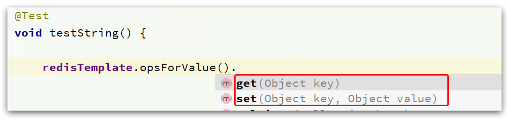

只不过写入前会把 Object 序列化为字节形式，默认是采用 JDK 序列化，得到的结果是这样的：

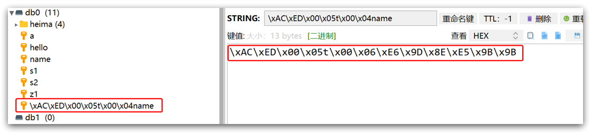

缺点：

- 可读性差
- 内存占用较大

我们可以自定义 RedisTemplate 的序列化方式，代码如下：

```java
@Configuration
public class RedisConfig {
    @Bean
    public RedisTemplate<String, Object> redisTemplate(RedisConnectionFactory connectionFactory){
        // 创建RedisTemplate对象
        RedisTemplate<String, Object> template = new RedisTemplate<>();
        // 设置连接工厂
        template.setConnectionFactory(connectionFactory);
        // 创建JSON序列化工具
        GenericJackson2JsonRedisSerializer jsonRedisSerializer = 
            							new GenericJackson2JsonRedisSerializer();
        // 设置key和hashKey采用string序列化
        template.setKeySerializer(RedisSerializer.string());
        template.setHashKeySerializer(RedisSerializer.string());
        // 设置value和hashValue采用JSON序列化
        template.setValueSerializer(jsonRedisSerializer);
        template.setHashValueSerializer(jsonRedisSerializer);
        // 返回
        return template;
    }
}
```

这里采用了 JSON 序列化来代替默认的 JDK 序列化方式。

来测试一下将一个 User 类存入 Redis 中：

```java
import lombok.AllArgsConstructor;
import lombok.Data;
import lombok.NoArgsConstructor;

@Data
@NoArgsConstructor
@AllArgsConstructor
public class User {
    private String name;
    private Integer age;
}
```

```java
@Test
void testSaveUser() {
    // 写入数据
    redisTemplate.opsForValue().set("user:100", new User("虎哥", 21));
    // 读取数据
    User user = (User) redisTemplate.opsForValue().get("user:100");
    System.out.println("user = " + user);
}
```

最终结果如图：

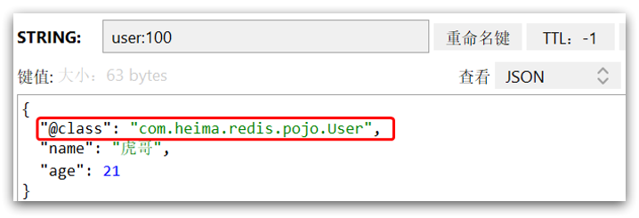

整体可读性有了很大提升，并且能将 Java 对象自动的序列化为 JSON 字符串，并且查询时能自动把 JSON 反序列化为 Java 对象。不过，其中记录了序列化时对应的 class 名称，目的是为了查询时实现自动反序列化。这会带来额外的内存开销。

### 3.4、StringRedisTemplate

尽管 JSON 的序列化方式可以满足我们的需求，但依然存在一些问题。如图：


为了在反序列化时知道对象的类型，JSON 序列化器会将类的 class 类型写入 JSON 结果中，存入 Redis，会带来额外的内存开销。

为了减少内存的消耗，我们可以采用手动序列化的方式，换句话说，就是不借助默认的序列化器，而是我们自己来控制序列化的动作，同时我们只采用 String 的序列化器，这样，在存储 value 时，我们就不需要在内存中就不用多存储数据，从而节约我们的内存空间。

为了节省内存空间，我们可以不使用 JSON 序列化器来处理 value，而是统一使用 String 序列化器，要求只能存储 String 类型的 key 和 value。当需要存储 Java 对象时，手动完成对象的序列化和反序列化。


因为存入和读取时的序列化及反序列化都是我们自己实现的，SpringDataRedis 就不会将 class 信息写入 Redis 了。

这种用法比较普遍，因此 SpringDataRedis 就默认提供了一个 RedisTemplate 的子类：StringRedisTemplate，它的 key 和 value 的序列化方式默认就是 String 方式。


省去了我们自定义 RedisTemplate 的序列化方式的步骤，而是直接使用：

```java
@SpringBootTest
class RedisStringTests {
    // @Autowired
    @Resource
    private StringRedisTemplate stringRedisTemplate;
    // JSON序列化工具
    private static final ObjectMapper mapper = new ObjectMapper();

    @Test
    void testString() {
        // 写入一条String数据
        stringRedisTemplate.opsForValue().set("name","虎哥");
        // 获取string数据
        String name = stringRedisTemplate.opsForValue().get("name");
        System.out.println("name = " + name);
    }

    @Test
    void testSaveUser() throws JsonProcessingException {
        // 创建对象
        User user = new User("虎哥", 21);
        // 手动序列化
        String json = mapper.writeValueAsString(user);
        // 写入数据
        stringRedisTemplate.opsForValue().set("user:200", json);
        // 读取数据
        String jsonUser = stringRedisTemplate.opsForValue().get("user:200");
        // 手动反序列化
        User user1 = mapper.readValue(jsonUser, User.class);
        System.out.println("user1 = " + user1);
    }
}
```

此时我们再来看一看存储的数据，就会发现那个 class 数据已经不在了，节约了我们的空间

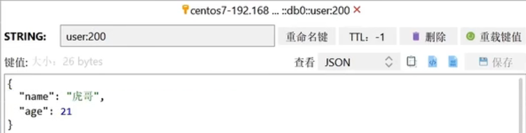

> 总结一下 RedisTemplate 的两种序列化实践方案：
>
> 1. 方案一：
>
>    * 自定义 RedisTemplate
>
>    * 修改 RedisTemplate 的序列化器为 GenericJackson2JsonRedisSerializer
>
> 2. 方案二：
>
>    * 使用 StringRedisTemplate
>
>    * 写入 Redis 时，手动把对象序列化为 JSON
>
>    * 读取 Redis 时，手动把读取到的 JSON 反序列化为对象

### 3.5、Hash结构操作

在基础篇的最后，咱们对 Hash 结构操作一下，收一个小尾巴，这个代码咱们就不再解释了

马上就开始新的篇章，进入到 Redis 实战篇

```java
@SpringBootTest
class RedisStringTests {
    @Autowired
    private StringRedisTemplate stringRedisTemplate;

    @Test
    void testHash() {
        stringRedisTemplate.opsForHash().put("user:400", "name", "虎哥");
        stringRedisTemplate.opsForHash().put("user:400", "age", "21");

        Map<Object, Object> entries = stringRedisTemplate.opsForHash().entries("user:400");
        System.out.println("entries = " + entries);
    }
}
```